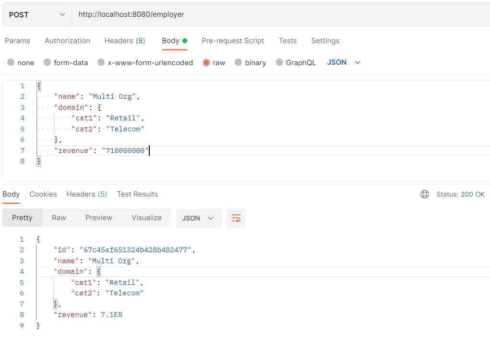
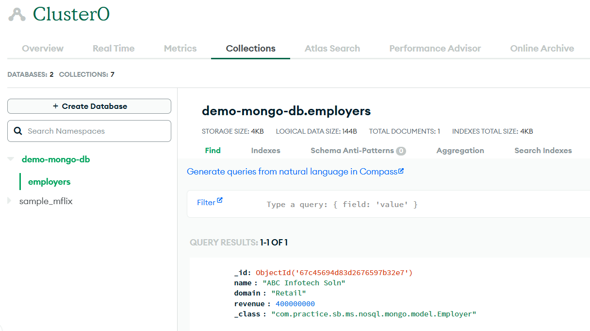

# sb-mongo-crud
This java based springboot project is just doing CRUD operations for MongoDB. Atlas MongoDB Cloud is being used for this.

### Pre-requisites
- IntelliJ Community Version (with lombok plugin) is installed
- Open JDK 21 is installed
- An Atlas MongoDB Cloud account is available
- Postman for testing APIs

### Setup
- Get a java based spring boot project created though https://start.spring.io/
- Open it in Intellij
- Replace the content with this content
- Replace username, cluster name, password and database name with the actual value. If the database (or collection) is not available, it will be created automatically.
- run gradle build
- run springboot project
- Test all the endpoints (written in controller class) using postman

### Testing
- When you just run an endpoint for the first time, it creates a database (along with collection) in Atlas automatically

  

- If you face any connection issue, whitelist your local ip in Atlas Cloud.
- Test all endpoints

### Note
- This project is just for helping developers who are new to mongodb and springboot
- This is not a production grade codebase, developer may have to make changes to make it production-grade
